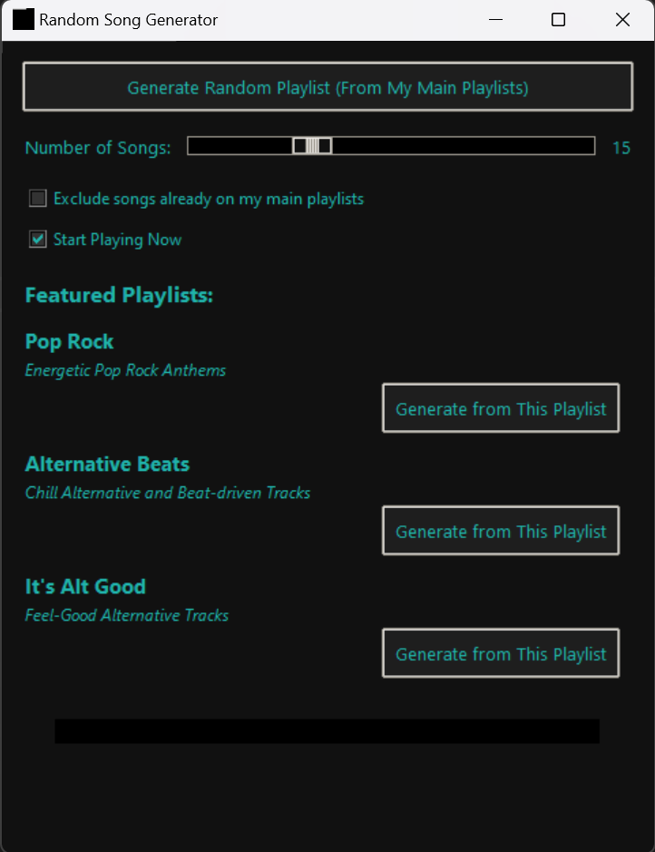

# Spotify Random Playlist Generator

This tool creates a new Spotify playlist with songs randomly generated from the artists of whichever source playlists you specify. It launches a simple GUI for customizing song count, playback, and source selection. You can customize the config file with your main playlists or any optional secondary playlists.

## Features
- **Four random selection methods** (plain random, same album, top tracks, full discography).
- **Exclude main playlists** (avoid tracks you already have daily).
- **Immediate playback** on a detected Spotify device (optional).
- **Opens** the new playlist in your browser and attempts to open in the desktop client.
- **JSON‐based config** for easy customization.
- **Random Theme Color** each time the program starts.

## Requirements
- Python 3.x
- [Spotipy](https://spotipy.readthedocs.io/) (`pip install spotipy`)
- [Spotify Developer](https://developer.spotify.com/dashboard/) App (client ID & secret)

## Setup
1. **Spotify Developer App**:
   - In your app settings, add a redirect URI (like `http://localhost:8080/callback`).
   - Copy the Client ID and Client Secret.

2. **`my_config.json`**:
   ```json
   {
     "client_id": "YOUR_SPOTIFY_CLIENT_ID",
     "client_secret": "YOUR_SPOTIFY_CLIENT_SECRET",
     "redirect_uri": "http://localhost:8080/callback",
     "scope": "playlist-read-private playlist-modify-private user-read-private user-library-read user-modify-playback-state user-read-playback-state",
     "main_playlist_ids": [
       "YOUR_MAIN_PLAYLIST_ID_1",
       "YOUR_MAIN_PLAYLIST_ID_2"
     ],
     "featured_playlists": [
       {
         "id": "YOUR_FEATURED_PLAYLIST_ID",
         "name": "Some Playlist Name",
         "genres": "Short description"
       }
     ]
   }
   ```
   - **`main_playlist_ids`**: your go-to playlists (excluded if you check the box).
   - **`featured_playlists`**: extra source playlists you can generate from.

3. **Run**:
   - Directly:
     ```bash
     python SpotifyRandomizer.py
     ```
   - Or via a `.bat` file (Windows):
     ```bat
     @echo off
     python SpotifyRandomizer.py
     pause
     ```

4. **GUI**:
   - **Number of Songs**: how many to generate.
   - **Exclude songs** from your main playlists if you want no duplicates.
   - **Start Playing Now**: automatically plays the new playlist.
   - **Generate** from your main or featured playlists (buttons).

## How It Works
1. The script picks each song by randomly choosing **one** of four methods:
   - **Random from Source** (just picks from your listed source tracks)
   - **Same Album** (picks a track from the same album as a random seed)
   - **Artist Top Tracks** (picks a track from a random artist’s top tracks)
   - **Artist Discography** (picks a track from any album by that artist)
2. It checks if the track is available in the US market and, if the “exclude main” box is checked, ensures it’s not already in one of your main playlists.
3. Continues until it collects the requested number of valid songs.
4. Creates a new private playlist and optionally starts playback.

## Notes
- To make the playlist public, change `public=False` to `public=True` in the code.
- Expect duplicates unless you exclude main.
- Some tracks are skipped if they’re not available in the US.
- Must have permission to read the playlists you use in `my_config.json`.
