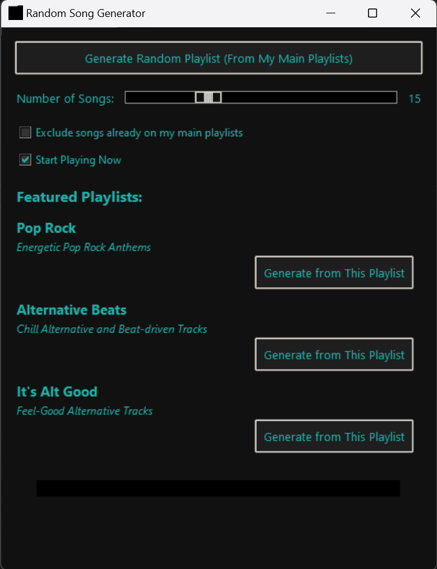

# Spotify Random Playlist Generator

This makes a new Spotify playlist by pulling random songs from the artists connected to whatever source playlists you give it. It opens a simple GUI, lets you choose how many songs you want, and can optionally start playing the new playlist right away.

## Features
- Four random selection methods:
  - random from the source playlists
  - another track from the same album
  - a top track from the same artist
  - a track from that artist's wider discography
- Can skip tracks that already exist in your main playlists
- Can start playback immediately on an available Spotify device
- Opens the generated playlist in your browser and tries to open it in the desktop app too
- Uses a simple JSON config for playlists and app credentials
- Picks a random theme color on startup

## Requirements
- Python 3.x
- [Spotipy](https://spotipy.readthedocs.io/) (`pip install spotipy`)
- A [Spotify Developer](https://developer.spotify.com/dashboard/) app

## Setup
1. Create a Spotify developer app.
   - Add a redirect URI like `http://localhost:8080/callback`
   - Copy the client ID and client secret

2. Copy `my_config.example.json` to `my_config.json`.

3. Fill in `my_config.json`:
   ```json
   {
     "client_id": "YOUR_SPOTIFY_CLIENT_ID",
     "client_secret": "YOUR_SPOTIFY_CLIENT_SECRET",
     "redirect_uri": "http://localhost:8080/callback",
     "scope": "playlist-read-private playlist-modify-private user-read-private user-library-read user-modify-playback-state user-read-playback-state",
     "main_playlist_ids": [
       "YOUR_MAIN_PLAYLIST_ID_1",
       "YOUR_MAIN_PLAYLIST_ID_2"
     ],
     "featured_playlists": [
       {
         "id": "YOUR_FEATURED_PLAYLIST_ID",
         "name": "Some Playlist Name",
         "genres": "Short description"
       }
     ]
   }
   ```
   - `main_playlist_ids` are your main playlists
   - `featured_playlists` are optional extra playlists to generate from

4. Run it:
   ```bash
   python SpotifyRandomizer.py
   ```

   Or on Windows:
   ```bat
   SpotifyRandomizer.bat
   ```

5. In the GUI:
   - choose the number of songs
   - decide whether to exclude songs from your main playlists
   - decide whether playback should start immediately
   - generate from your main playlists or one of the featured playlists

## How It Works
1. It gathers tracks from the playlists you selected.
2. Each song slot uses one of the random selection methods.
3. If duplicate filtering is on, it skips anything already in your main playlists.
4. It skips tracks that are not available in the US market.
5. When the list is full, it creates a new private playlist and can start playback immediately.

## Notes
- The app looks for `my_config.json` and keeps Spotify token cache data in `my_token_cache.json`, so both are ignored by Git.
- If you want public playlists instead of private ones, change `public=False` in the code.
- Expect duplicates unless you turn on the main-playlist exclusion option.
- Some tracks get skipped if Spotify does not allow them in the US market.
- You need permission to read whatever playlists you use in your config.
